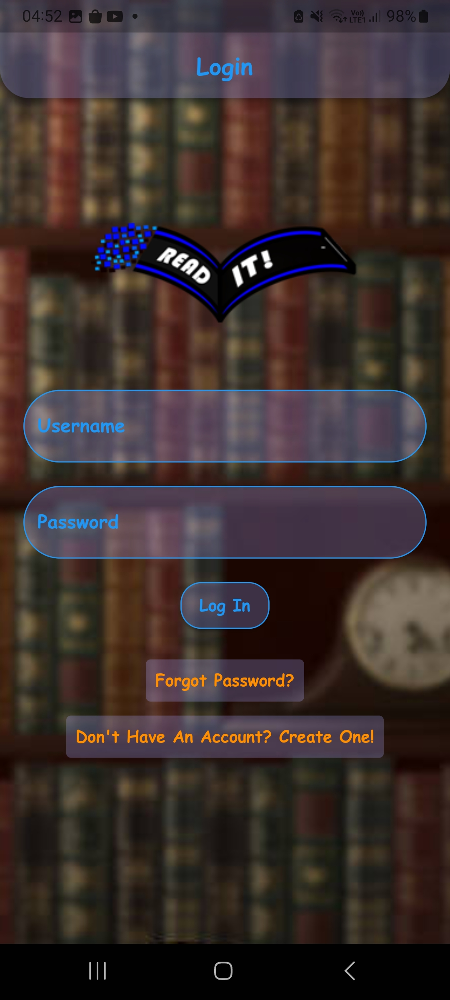
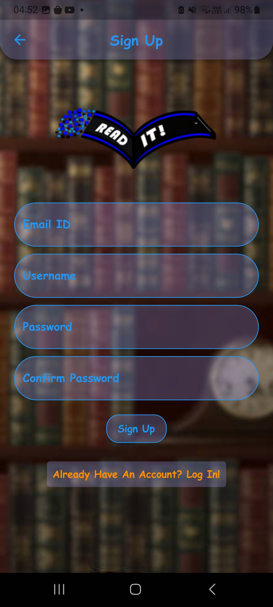
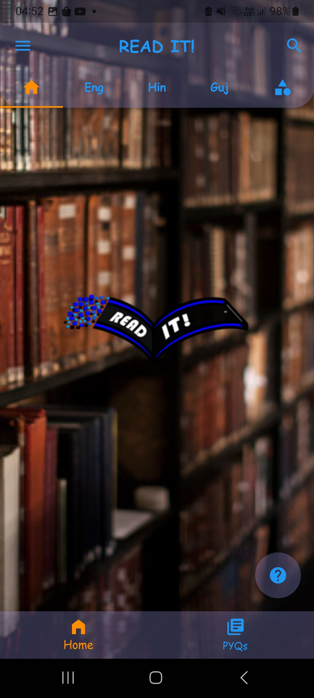
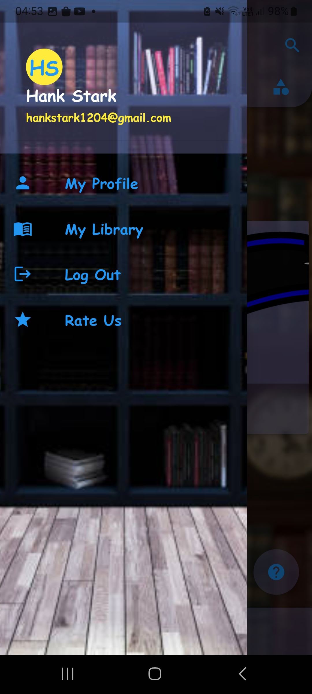
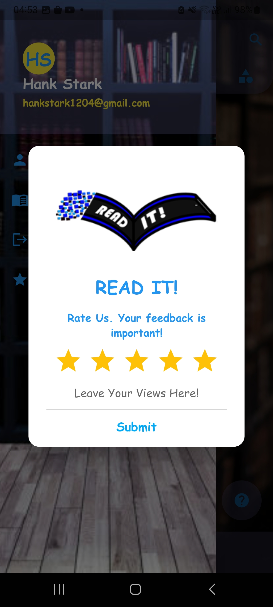
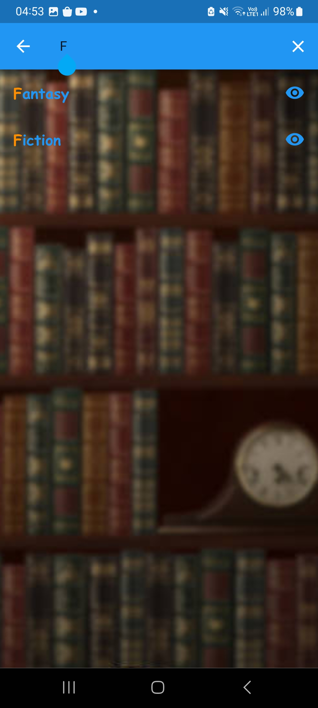
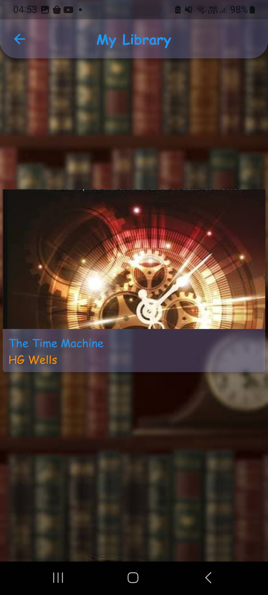
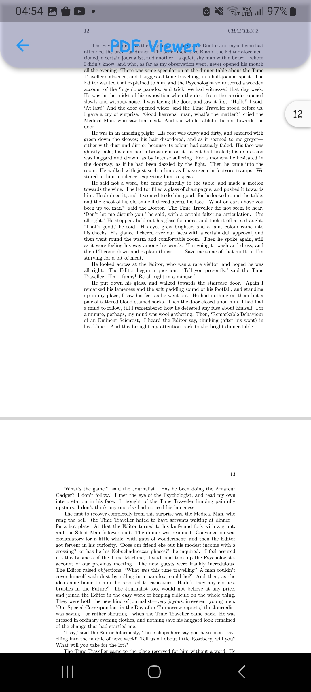

# Read It!

**Read It!** is a mobile application solution prototype catered to the problem statement to digitalize a govt. library provided by Jamnagar Municipal Corporation as part of SSIP Azadi Ka Amrit Mahotsav Hackathon 2K22-23.


## Screenshots

<!--  -->
<p float="left" align="middle">
  
  
  
</p>

<p float="left" align="middle">
  
  
  
</p>

<p float="left" align="middle">
  
  
  
</p>


## Run Locally

Clone the project

```bash
git clone https://github.com/HarshAwasthi1204/read-it.git
```

Go to the project directory

```bash
cd read-it
```

Install dependencies

```bash
flutter pub get
```

Boot an emulator and run the app

```bash
flutter run main.dart
```


## Tech Stack

<div align="center">
  
  
  
  
  
  
  
  
  
</div>

###